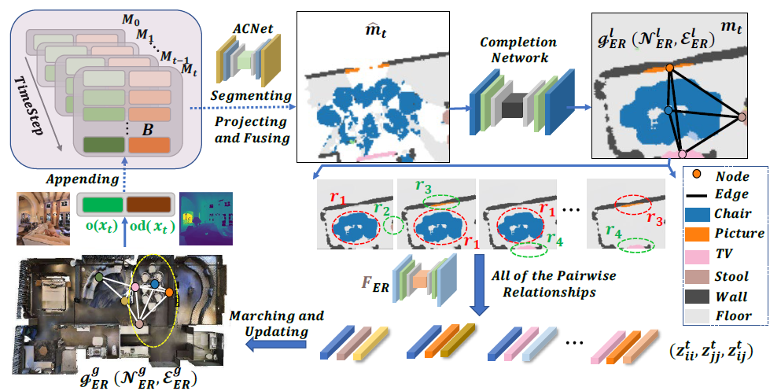
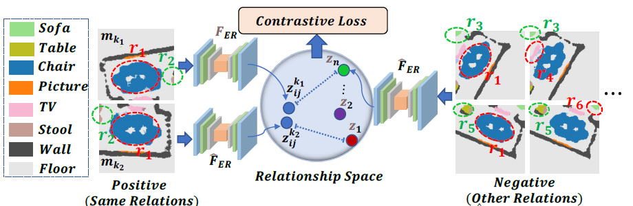
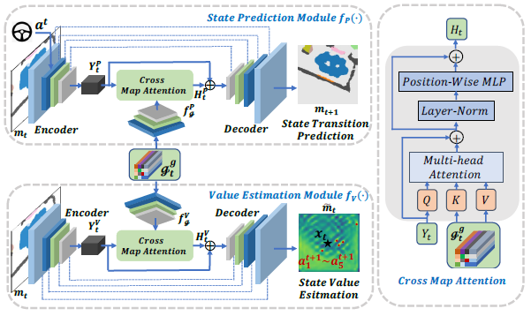
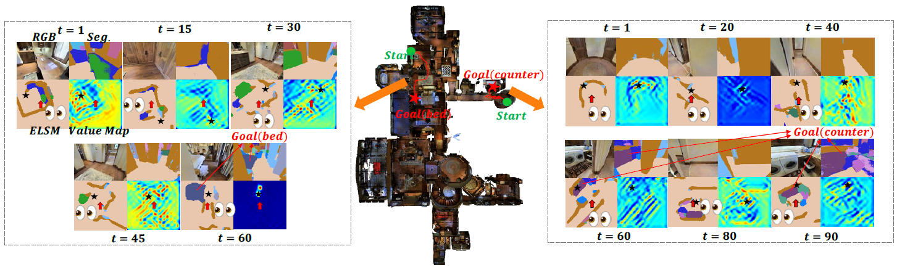

# ObjectNav-CER
This repository contains the codes for our paper, which is titled "Think Holistically, Act Down-to-Earth: A Semantic Navigation Strategy with Continuous Environmental Representation and Multi-step Forward Planning".

# Abstract
The overview of CER learning:

	

The illustration of ER contrastive learning:

	

The illustration of the value estimation module and the state prediction module:

	

The object goal navigation task requires the agent to navigate through a previously unknown environment using spatial and semantic contextual information, where the goal is usually specified by a semantic label (e.g., find a TV). Such a navigation task is especially challenging as it requires formulating and understanding the complex co-occurrence relations among objects in diverse settings, which is critical for long-sequence navigation decision-making. Existing methods learn to either explicitly represent semantic priors as discrete relationships, or implicitly encode them from raw and rough observations, thus can not benefit from the rich environmental semantics. In this work, we propose a novel Deep Reinforcement Learning (DRL) based ObjectNav framework that learns to actively imagine spatial and semantic clues outside the agent's field of view and further mine Continuous Environmental Representations (CER) using self-supervised learning. We verify that our approach combining map-based imagination and CER facilitates the learning of complicated semantic priors and navigation skills. Additionally, the illusion of spatial and semantic patterns allows the agent to perform Multi-Step Forward-Looking Planning (MSFLP) by considering the temporal evolution of egocentric local observations. Our approach is thoroughly evaluated and ablated in the visually realistic environments of the Matterport3D (MP3D) dataset. The experimental results reflect that our approach incorporating CER and foresight planning achieves state-of-the-art performance on the ObjectNav task. In addition, adequate quantitative and qualitative analyses validate the excellent generalization ability and superiority of our method. 

# Dataset

Coming Soon ...

# Pretrained Models

Coming Soon ...

# Getting Started

Coming Soon ...

# Examples and Demos
Illustrations of object goal navigation: Two complete navigation processes in the test environment named 2azQ1b91cZZ are illustrated. The goals of the two navigation tasks are the bed and the counter, respectively. At each interval timestep, the RGB observation, semantic segmentation, ELSM, and value map are displayed. The red arrows indicate the agent’s positions and the orientations in the ELSMs. Black stars indicate navigation sub-goals at the specified time step.

	

An ObjectNav demo video:

# Acknowledge

This work is based on [SSCNav](https://github.com/real-stanford/SSCNav). The authors thank Liang, Yiqing and Chen, Boyuan and Song, Shuran for their works.

This work is based on [Object-Goal-Navigation](https://github.com/devendrachaplot/Object-Goal-Navigation). The authors thank Devendra Singh Chaplot, Dhiraj Gandhi, Abhinav Gupta, Ruslan Salakhutdinov for their works.

This work was supported in part by the National Natural Science Foundation of China under 62172443, in part by the Natural Science Foundation of Hunan Province under 2022JJ30760, in part by the Natural Science Foundation of Changsha under kq2202107 and kq2202108. We are grateful for resources from the High-Performance Computing Center of Central South University.
